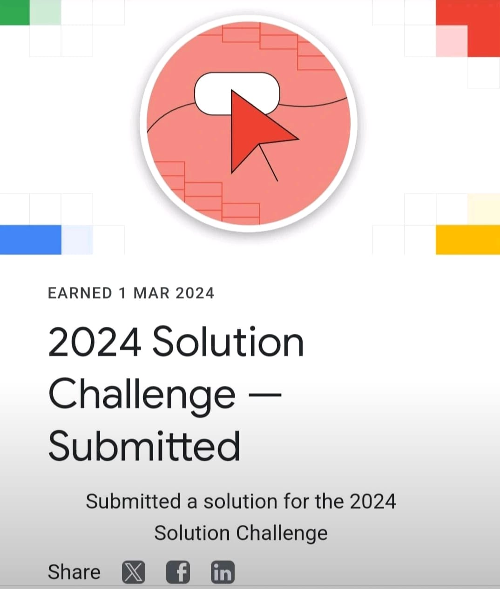
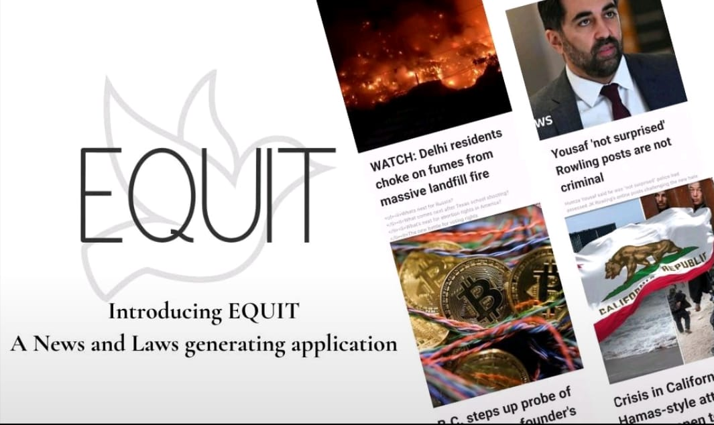
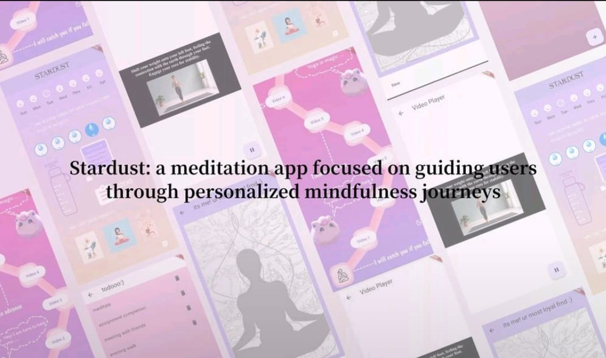

# JusticeSphere - Empowering Through Knowledge and Healing

JusticeSphere is a comprehensive solution aimed at promoting peace, justice, and empowerment through two innovative Flutter applications and an informative website. Our project addresses two key United Nations Sustainable Development Goals:

- Quality Education (SDG 4)
- Peace, Justice & Strong Institutions (SDG 16)

## Project Components

### 1. Equit App
A Flutter-based application focused on empowering citizens through knowledge:
- Access to simplified constitutional rights
- Real-time social awareness through News APIs
- Integration with Gemini for intelligent insights
- User-friendly interface for legal information

### 2. Stardust App
A meditation and healing app designed for victims of injustice:
- Guided yoga sessions
- Meditation video resources
- Trauma healing support
- Peaceful interface design with custom fonts

### 3. JusticeSphere Website
A responsive website that showcases both applications and our mission:
- Detailed information about both apps
- Project mission and vision
- Download links for applications
- Social media integration

## Application Screenshots

### Project Badge

*Google Developer Student Clubs Solution Challenge Achievement*

### Equit App

*Equit app interface showing news feed and legal information*

### Stardust App

*Stardust app interface featuring yoga and meditation sessions*

## Technology Stack

### Equit App
- Flutter Framework
- HTTP package for API integration
- WebView Flutter for web content
- URL Launcher for external links

### Stardust App
- Flutter Framework
- Video Player package
- Custom fonts (Starstruck, Kinkie-Zpwm)
- Asset management for media content

### Website
- HTML5
- CSS3
- JavaScript
- AOS (Animate On Scroll) library
- Font Awesome icons
- Google Fonts (Poppins)

## Setup Instructions

Detailed setup instructions for each component can be found in their respective directories:
- [Equit App Setup Guide](equit1/README.md)
- [Stardust App Setup Guide](stardust1/README.md)
- [Website Setup Guide](justicesphere1/README.md)

## Prerequisites

- Flutter SDK (>=3.2.5)
- Dart SDK
- Android Studio/VS Code with Flutter plugins
- Web browser for website development
- Git for version control

## Contact

- Email: equitysquad004@gmail.com

## License

This project is licensed under the MIT License - see the LICENSE file for details.

## Contributing

We welcome contributions to any part of the project. Please read our contributing guidelines before submitting pull requests.

## Acknowledgments

- GDSC Solution Challenge team
- All contributors and supporters
- Open source community